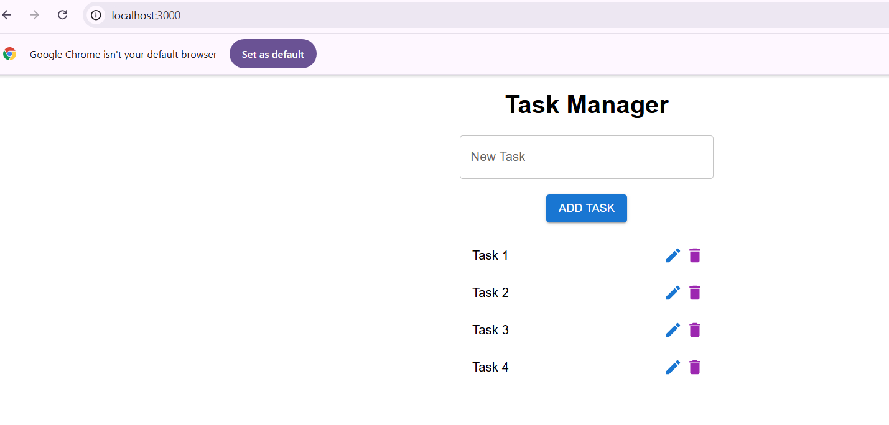

# Task Management Frontend - react

## How to run the app
#### Requires node installation
```https://docs.npmjs.com/downloading-and-installing-node-js-and-npm```

#### Run the command to compile react into js script
```npm install```

#### Start the app
```npm start```


#### Make sure the back group rest api is running

### APP screenshots

